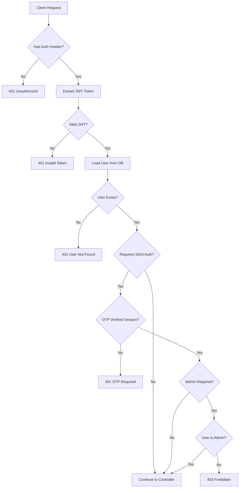
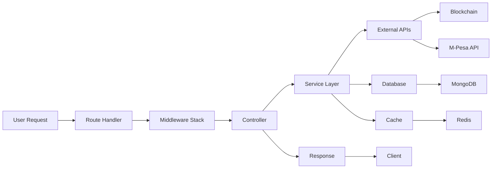
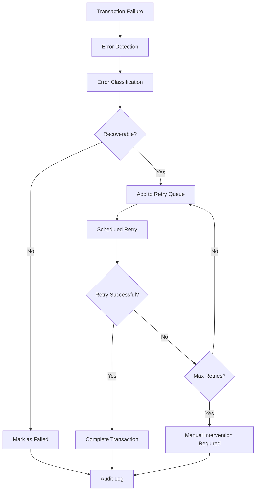

# NexusPay Architecture Overview
## Cross-Layer System Architecture Documentation

> **Generated on:** `r new Date().toISOString()`
> **Version:** v2.0

---

## 🏗️ System Architecture

NexusPay is built on a **modern layered architecture** with clear separation of concerns, enabling scalability, maintainability, and security across all system components.

```
┌─────────────────────────────────────────────────────────────────────────┐
│                          FRONTEND LAYER                                 │
│                    (React/Next.js Applications)                         │
└─────────────────────────────┬───────────────────────────────────────────┘
                              │ HTTPS/WSS
                              ▼
┌─────────────────────────────────────────────────────────────────────────┐
│                           API GATEWAY                                   │
│              (Express.js + Security Middleware)                         │
├─────────────────────────────────────────────────────────────────────────┤
│ • CORS Policy               • Rate Limiting (100 req/15min)             │
│ • Helmet Security           • Request/Response Logging                   │
│ • Compression               • Error Handling                             │
└─────────────────────────────┬───────────────────────────────────────────┘
                              │
                              ▼
┌─────────────────────────────────────────────────────────────────────────┐
│                         ROUTE LAYER                                     │
│                    (10 Distinct Route Modules)                          │
├─────────────────────────────────────────────────────────────────────────┤
│ /auth        │ /business    │ /token      │ /mpesa     │ /admin          │
│ /transactions│ /liquidity   │ /ramp       │ /platform- │ /health         │
│              │              │             │ wallet     │                 │
└─────────────────────────────┬───────────────────────────────────────────┘
                              │
                              ▼
┌─────────────────────────────────────────────────────────────────────────┐
│                       MIDDLEWARE LAYER                                  │
│                   (Security & Validation)                               │
├─────────────────────────────────────────────────────────────────────────┤
│ Authentication Stack:       │ Validation Stack:                          │
│ • authenticate             │ • Zod Schemas                              │
│ • enforceStrictAuth        │ • Express Validator                        │
│ • authenticateToken        │ • Custom Validators                        │
│ • isAdmin                  │ • Input Sanitization                       │
└─────────────────────────────┬───────────────────────────────────────────┘
                              │
                              ▼
┌─────────────────────────────────────────────────────────────────────────┐
│                      CONTROLLER LAYER                                   │
│                    (11 Specialized Controllers)                         │
├─────────────────────────────────────────────────────────────────────────┤
│ authController              │ businessController                         │
│ tokenController             │ mpesaController (3195 lines)               │
│ adminController             │ transactionController                      │
│ liquidityController         │ rampController                             │
│ platformWalletController    │ monitoringController                       │
│ usdcController                                                           │
└─────────────────────────────┬───────────────────────────────────────────┘
                              │
                              ▼
┌─────────────────────────────────────────────────────────────────────────┐
│                       SERVICE LAYER                                     │
│                   (25+ Specialized Services)                            │
├─────────────────────────────────────────────────────────────────────────┤
│ Core Infrastructure:        │ Financial Services:                        │
│ • platformWallet (82KB)     │ • mpesa (30KB)                            │
│ • database                  │ • token (26KB)                            │
│ • redis                     │ • rates (7.9KB)                           │
│ • scheduler                 │ • feeService (11KB)                       │
│ • queue                     │ • swapService                             │
│                            │                                            │
│ Business Logic:             │ Monitoring & Recovery:                     │
│ • liquidityService (16KB)   │ • transactionLogger (6.8KB)              │
│ • rampService (8KB)         │ • transactionMonitor (12KB)              │
│ • yieldService              │ • transactionRecovery (7.8KB)            │
│ • cryptoRelease             │ • reconciliation                          │
│                            │                                            │
│ Communication:              │ Utilities:                                 │
│ • email (10KB)              │ • utils (3.5KB)                          │
│ • auth (3.8KB)              │ • wallet                                  │
│ • otpService                │ • mpesaUtils                              │
└─────────────────────────────┬───────────────────────────────────────────┘
                              │
                              ▼
┌─────────────────────────────────────────────────────────────────────────┐
│                        DATA LAYER                                       │
│                    (MongoDB + Redis Cache)                              │
├─────────────────────────────────────────────────────────────────────────┤
│ MongoDB Collections:        │ Redis Cache:                               │
│ • users                     │ • Session storage                          │
│ • businesses                │ • Rate limiting                           │
│ • transactions              │ • Token prices                            │
│ • escrows                   │ • Conversion rates                        │
│ • verifications             │ • Wallet balances                         │
│ • liquidityprovisions       │ • Queue management                        │
│ • ramptransactions          │                                           │
└─────────────────────────────┬───────────────────────────────────────────┘
                              │
                              ▼
┌─────────────────────────────────────────────────────────────────────────┐
│                      EXTERNAL INTEGRATIONS                              │
│                    (Blockchain & Payment APIs)                          │
├─────────────────────────────────────────────────────────────────────────┤
│ Blockchain Networks:        │ Payment Providers:                         │
│ • Arbitrum                  │ • M-Pesa API                              │
│ • Polygon                   │ • Safaricom STK Push                      │
│ • Celo                      │ • B2C Payments                            │
│ • Base, Optimism           │ • Paybill/Till Integration                │
│ • Ethereum, BNB            │                                           │
│ • 18+ Supported Chains      │ Communication:                            │
│                            │ • Email (SMTP)                            │
│ Token Standards:            │ • SMS (Africa's Talking)                  │
│ • ERC-20 Tokens            │ • Push Notifications                      │
│ • Native Tokens            │                                           │
│ • Stablecoins (USDC/USDT)  │                                           │
└─────────────────────────────────────────────────────────────────────────┘
```

---

## 🎯 Layer Responsibilities

### 1. **Route Layer** (`/src/routes/`)

**Purpose**: API endpoint definition and organization

**Structure**:
```typescript
┌── authRoutes.ts (255 lines)      // Authentication & user management
├── businessRoutes.ts (37 lines)   // Business account operations  
├── tokenRoutes.ts (46 lines)      // Crypto token operations
├── mpesaRoutes.ts (90 lines)      // M-Pesa payment integration
├── adminRoutes.ts (43 lines)      // Administrative functions
├── transactionRoutes.ts (128 lines) // Transaction history & analytics
├── liquidityRoutes.ts (33 lines)  // Liquidity provision
├── rampRoutes.ts (27 lines)       // Fiat on/off ramp
├── platformWalletRoutes.ts (31 lines) // Platform wallet management
└── System endpoints (health, verification)
```

**Key Features**:
- RESTful API design patterns
- Middleware composition per route
- Comprehensive input validation
- Role-based access control
- Rate limiting implementation

### 2. **Middleware Layer** (`/src/middleware/`)

**Purpose**: Cross-cutting concerns (auth, validation, security)

**Components**:
```typescript
┌── Security Stack
│   ├── auth.ts (135 lines)               // Standard JWT authentication
│   ├── strictAuthMiddleware.ts (212 lines) // OTP-enhanced authentication  
│   ├── authMiddleware.ts (125 lines)      // Legacy auth support
│   ├── roleMiddleware.ts (59 lines)       // Role-based access control
│   └── rateLimiting.ts (124 lines)        // Rate limiting & protection
│
├── Validation Stack  
│   ├── validation.ts (90 lines)           // Unified validation middleware
│   └── validators/                        // Route-specific validators
│       ├── authValidators.ts
│       ├── mpesaValidators.ts
│       ├── tokenValidators.ts
│       └── adminValidators.ts
```

**Security Features**:
- Multi-tier authentication (JWT → JWT+OTP → JWT+OTP+Role)
- Session tracking for sensitive operations
- Input sanitization and validation
- Request rate limiting (global + operation-specific)
- CORS policy enforcement

### 3. **Controller Layer** (`/src/controllers/`)

**Purpose**: Request handling, business logic orchestration, response formatting

**Architecture**:
```typescript
┌── Core Controllers
│   ├── authController.ts (690 lines)      // User auth & session management
│   ├── tokenController.ts (555 lines)     // Crypto operations
│   ├── mpesaController.ts (3195 lines)    // Payment processing hub
│   └── adminController.ts (510 lines)     // System administration
│
├── Financial Controllers
│   ├── transactionController.ts (710 lines) // Transaction management
│   ├── liquidityController.ts (311 lines)  // Liquidity operations  
│   ├── rampController.ts (140 lines)       // Fiat conversion
│   └── platformWalletController.ts (176 lines) // Wallet management
│
└── Business Controllers
    ├── businessController.ts (666 lines)   // Business accounts
    ├── monitoringController.ts (246 lines) // System monitoring
    └── usdcController.ts (43 lines)        // USDC-specific operations
```

**Design Patterns**:
- Input validation → Service delegation → Response formatting
- Comprehensive error handling with standardized responses
- Async/await for non-blocking operations
- Transaction logging and audit trails

### 4. **Service Layer** (`/src/services/`)

**Purpose**: Core business logic, external integrations, data processing

**Service Categories**:

#### 🏗️ **Infrastructure Services**
```typescript
├── platformWallet.ts (2551 lines)    // Multi-chain wallet management
├── database.ts (33 lines)            // MongoDB connection management  
├── redis.ts (101 lines)              // Cache and session management
├── scheduler.ts (101 lines)          // Background job processing
└── queue.ts (78 lines)               // Async task management
```

#### 💰 **Financial Services**
```typescript
├── mpesa.ts (802 lines)              // M-Pesa API integration
├── token.ts (742 lines)              // Blockchain token operations
├── rates.ts (225 lines)              // Currency conversion rates
├── feeService.ts (310 lines)         // Fee calculation & management
└── swapService.ts (131 lines)        // Token swapping operations
```

#### 🔄 **Business Logic Services**
```typescript
├── liquidityService.ts (443 lines)   // Liquidity pool management
├── rampService.ts (234 lines)        // Fiat conversion services
├── yieldService.ts (156 lines)       // Yield farming operations
└── cryptoRelease.ts (137 lines)      // Crypto release mechanisms
```

#### 📊 **Monitoring & Recovery**
```typescript
├── transactionLogger.ts (239 lines)    // Transaction audit trail
├── transactionMonitor.ts (416 lines)   // Real-time monitoring
├── transactionRecovery.ts (238 lines)  // Failed transaction recovery
├── mpesaRetry.ts (230 lines)          // M-Pesa retry mechanisms
└── reconciliation.ts (53 lines)       // Financial reconciliation
```

#### 📞 **Communication Services**
```typescript
├── email.ts (266 lines)              // Email notifications & OTP
├── auth.ts (125 lines)               // Authentication utilities
└── otpService.ts (46 lines)          // OTP generation & validation
```

### 5. **Data Layer** (`/src/models/`)

**Purpose**: Data persistence, schema definition, relationship management

**Model Architecture**:
```typescript
┌── User Management
│   ├── models.ts (128 lines)         // Primary user model
│   ├── userModel.ts (64 lines)       // Alternative user model
│   └── verificationModel.ts (70 lines) // Identity verification
│
├── Business Operations  
│   ├── businessModel.ts (110 lines)  // Business account model
│   ├── escrowModel.ts (106 lines)    // Transaction escrow
│   └── escrow.ts (95 lines)          // Escrow operations
│
└── Financial Operations
    ├── RampTransaction.ts (117 lines) // Fiat conversion transactions
    └── LiquidityProvider.ts (96 lines) // Liquidity provision tracking
```

**Data Relationships**:
```
User (1:N) → Business Accounts
User (1:N) → Transactions  
User (1:N) → Liquidity Positions
User (1:N) → Verification Records
Transaction (1:1) → Escrow Record
Business (1:N) → Business Transactions
```

---

## 🔐 Security Architecture

### Multi-Layer Security Model

```
┌─────────────────────────────────────────────────────────────┐
│                      SECURITY LAYERS                        │
├─────────────────────────────────────────────────────────────┤
│ 🌐 Network Security                                         │
│ • HTTPS/TLS encryption                                      │
│ • CORS policy enforcement                                   │
│ • Rate limiting (global + endpoint-specific)               │
│ • DDoS protection                                          │
├─────────────────────────────────────────────────────────────┤
│ 🔐 Authentication & Authorization                           │
│ • Multi-tier auth (Basic → Strict → Admin)                 │
│ • JWT token management                                      │
│ • OTP verification for sensitive operations                │
│ • Role-based access control                                │
│ • Session tracking and management                          │
├─────────────────────────────────────────────────────────────┤
│ 🛡️ Input Security                                          │
│ • Comprehensive input validation                           │
│ • SQL injection prevention                                 │
│ • XSS protection                                          │
│ • Schema-based validation (Zod + Express-Validator)       │
├─────────────────────────────────────────────────────────────┤
│ 💰 Financial Security                                       │
│ • Multi-signature wallet operations                        │
│ • Transaction escrow mechanisms                            │
│ • Automatic rollback for failed operations                │
│ • Comprehensive audit logging                              │
│ • Real-time transaction monitoring                         │
├─────────────────────────────────────────────────────────────┤
│ 🔒 Data Security                                           │
│ • Encrypted sensitive data storage                         │
│ • Secure private key management                            │
│ • Redis session encryption                                 │
│ • Database connection security                             │
└─────────────────────────────────────────────────────────────┘
```

### Authentication Flow



---

## ⚡ Performance Architecture

### Caching Strategy

```typescript
┌── Redis Cache Layers
│   ├── Session Management
│   │   ├── User sessions (24h TTL)
│   │   ├── OTP verification states (5min TTL)
│   │   └── Strict auth sessions (1h TTL)
│   │
│   ├── Financial Data Cache
│   │   ├── Currency conversion rates (2min TTL)
│   │   ├── Token prices (1min TTL)
│   │   ├── Wallet balances (30s TTL)
│   │   └── Transaction fees (5min TTL)
│   │
│   ├── System Cache
│   │   ├── Platform wallet status (30s TTL)
│   │   ├── Chain configurations (1h TTL)
│   │   └── Rate limiting counters (15min TTL)
│   │
│   └── Queue Management
│       ├── Transaction processing queue
│       ├── Retry queue for failed operations
│       └── Background job scheduling
```

### Async Processing

```typescript
┌── Background Job System
│   ├── Transaction Processing
│   │   ├── Queue-based transaction handling
│   │   ├── Automatic retry mechanisms
│   │   ├── Failure recovery systems
│   │   └── Performance monitoring
│   │
│   ├── Scheduled Operations
│   │   ├── Transaction queue processing (30s)
│   │   ├── Retry processing (15s)
│   │   ├── Transaction recovery (5min)
│   │   └── System health checks (1min)
│   │
│   └── Real-time Features
│       ├── WebSocket connections for live updates
│       ├── Real-time transaction monitoring
│       └── Instant notification delivery
```

---

## 🌐 External Integration Architecture

### Blockchain Integration

```typescript
┌── Multi-Chain Support (18+ Networks)
│   ├── Layer 1 Blockchains
│   │   ├── Ethereum Mainnet
│   │   ├── BNB Smart Chain
│   │   └── Avalanche C-Chain
│   │
│   ├── Layer 2 Solutions
│   │   ├── Arbitrum One
│   │   ├── Polygon
│   │   ├── Optimism
│   │   └── Base
│   │
│   ├── Alternative Chains
│   │   ├── Celo
│   │   ├── Fantom Opera
│   │   ├── Gnosis Chain
│   │   └── Moonbeam
│   │
│   └── Emerging Networks
│       ├── Scroll
│       ├── Aurora
│       ├── Lisk
│       └── Somnia
```

### Payment Provider Integration

```typescript
┌── M-Pesa Integration Stack
│   ├── Core APIs
│   │   ├── STK Push (Customer Payments)
│   │   ├── B2C (Business to Customer)
│   │   ├── Paybill Integration
│   │   └── Till Number Payments
│   │
│   ├── Webhook Handlers
│   │   ├── Payment confirmation callbacks
│   │   ├── Timeout handling
│   │   ├── Queue processing notifications
│   │   └── Error notification handling
│   │
│   └── Enhanced Features
│       ├── Automatic retry mechanisms
│       ├── Manual receipt submission
│       ├── Transaction status tracking
│       └── Reconciliation systems
```

---

## 🔄 Data Flow Architecture

### Transaction Processing Flow



### Error Recovery Flow



---

## 📊 Monitoring & Observability

### Logging Architecture

```typescript
┌── Comprehensive Logging System
│   ├── Transaction Logging
│   │   ├── Complete audit trail for all transactions
│   │   ├── Performance metrics tracking
│   │   ├── Success/failure rate monitoring
│   │   └── Financial reconciliation data
│   │
│   ├── Security Logging
│   │   ├── Authentication attempts
│   │   ├── Authorization failures
│   │   ├── Rate limiting triggers
│   │   └── Suspicious activity detection
│   │
│   ├── System Logging
│   │   ├── Application performance metrics
│   │   ├── Database connection monitoring
│   │   ├── Cache hit/miss ratios
│   │   └── External API response times
│   │
│   └── Business Logging
│       ├── User behavior analytics
│       ├── Transaction pattern analysis
│       ├── Revenue and fee tracking
│       └── Conversion rate monitoring
```

### Health Monitoring

```typescript
┌── Health Check System
│   ├── Application Health
│   │   ├── Server uptime tracking
│   │   ├── Memory usage monitoring
│   │   ├── CPU utilization tracking
│   │   └── Request/response metrics
│   │
│   ├── Service Health
│   │   ├── Database connectivity
│   │   ├── Redis connectivity
│   │   ├── External API availability
│   │   └── Blockchain node status
│   │
│   └── Business Health
│       ├── Transaction success rates
│       ├── Platform wallet balances
│       ├── User activity metrics
│       └── Revenue generation tracking
```

---

## 🚀 Scalability Considerations

### Horizontal Scaling

- **Stateless Design**: Controllers and services designed for horizontal scaling
- **Session Externalization**: Redis-based session management
- **Queue-Based Processing**: Async job processing for transaction handling
- **Database Optimization**: Connection pooling and query optimization

### Vertical Scaling

- **Memory Management**: Efficient caching strategies
- **CPU Optimization**: Async/await patterns throughout
- **I/O Optimization**: Connection pooling for external services
- **Cache Optimization**: Multi-layer caching strategy

### Future Scaling Plans

- **Microservices Migration**: Potential service extraction
- **Database Sharding**: User-based data partitioning
- **CDN Integration**: Static asset optimization
- **Load Balancing**: Multi-instance deployment

---

## 📈 Development & Deployment

### Development Workflow

```typescript
┌── Development Environment
│   ├── Local Development Setup
│   │   ├── Docker containerization
│   │   ├── Environment variable management
│   │   ├── Database seeding scripts
│   │   └── Test data generation
│   │
│   ├── Testing Strategy
│   │   ├── Unit tests for services
│   │   ├── Integration tests for APIs
│   │   ├── End-to-end testing
│   │   └── Load testing for performance
│   │
│   └── Quality Assurance
│       ├── Code linting (ESLint)
│       ├── Type checking (TypeScript)
│       ├── Security scanning
│       └── Performance profiling
```

### Deployment Architecture

```typescript
┌── Production Deployment
│   ├── Infrastructure
│   │   ├── Cloud-based hosting
│   │   ├── Auto-scaling groups
│   │   ├── Load balancer configuration
│   │   └── SSL/TLS termination
│   │
│   ├── Database Setup
│   │   ├── MongoDB Atlas clusters
│   │   ├── Redis Cloud instances
│   │   ├── Backup strategies
│   │   └── Disaster recovery plans
│   │
│   └── Monitoring Setup
│       ├── Application performance monitoring
│       ├── Error tracking and alerting
│       ├── Log aggregation systems
│       └── Business metrics dashboards
```

---

*This architecture overview provides a comprehensive understanding of the NexusPay system design across all layers. The modular architecture ensures maintainability, scalability, and security while enabling rapid development and deployment of new features.*